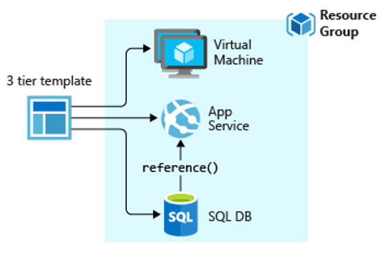

## ARM Templates

Azure Resource Manager Templates are JSON files used to automate the deployment of Azure environments using infrastructure as code. With the use of infrastructure as code, the code repository for your project's applications now also has the way to deploy all the infrastructure required by your application in a coded, repeatable and versioned manner in the same way as the applications themselves.

Through ARM Templates, you automate the entire deployment of your environment, from the creation of the network, storage, virtual machines, installation of dependencies to the deployment of the application itself in an orchestrated way.

If you are interested in knowing more about ARM Templates and how to use them, access the documentation available at [https://docs.microsoft.com/en-us/azure/azure-resource-manager/templates/overview](https://docs.microsoft.com/en-us/azure/azure-resource-manager/templates/overview) 

We currently have about 1000 templates ready and available for use in Azure Quickstart Templates, check out [https://azure.microsoft.com/en-us/resources/templates/](https://azure.microsoft.com/en-us/resources/templates/) 

