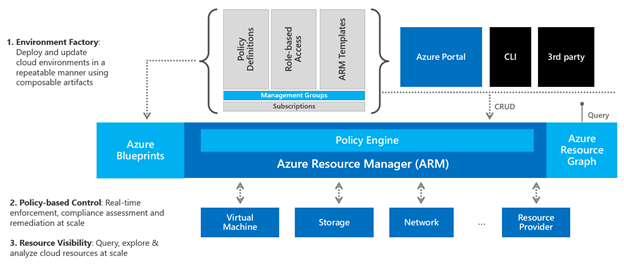

## Governance Architecture in Azure

Let's add these governance features to a diagram:

Think of multiple development teams or business units that want to consume Azure resources to meet their specific business requirements. How many of these people, especially DevOps, will readily know how to properly design and configure network components?

Ultimately, you want a quick and efficient way to deploy and update cloud environments in a repeatable way using combinable artifacts.

You would start by setting up your blueprints. And these blueprints would have all the basic and necessary components for an entire solution, such as their policy definitions, RBAC functions, ARM models, number of signatures needed and the preliminary groups already granted the appropriate access levels to the resources in that blueprint, such as their VMs, storage accounts, network components and any other resource providers.

Finally, you can take advantage of the Resource Graph to check the environment and ensure, for example, that the number of resources is in accordance with your budget.
