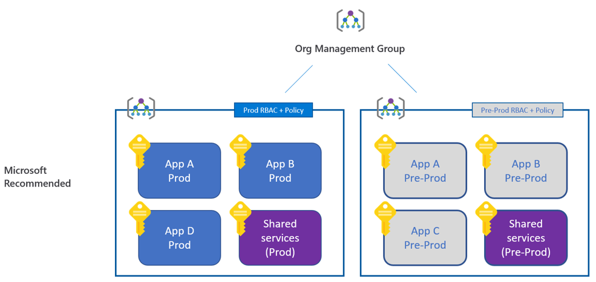
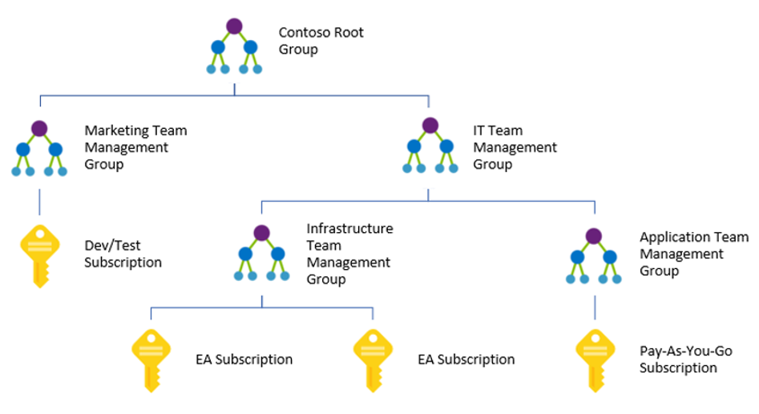

## Management Groups

In terms of the best practices of setting up governance in your environment structuring your hierarchy and organizing your resources is the first critical step.

Everything you do, from setting RBAC rules to resources, to Azure Policy to Blueprint, all of these things hang on to the hierarchy and the first benefit of Management Group is inheritance. So whatever you apply at the top will be inherited down to the lowest level of your structure.

Let's say a SOC team applies a set of security controls at the top to protect the entire environment. The problem today is that subscription owners can remove any control at the subscription level, and you often make development teams owners of the subscription just because they need that flexibility. With Management Groups this problem does not occur, as owners will not be able to remove inherited permissions from the top level.

You can also define more strict set of controls in production env vs test/pre prod for example. Or you may have a more cost-sensitive control in your test env. Or you can totally isolate your test environment from the Internet…

Another benefit of Management Groups is that if you made the wrong decisions setting up your controls you can create another management group hierarchy and move your subscriptions over without a pain.

Obviously, in addition to using Management Groups to manage policy enforcement in different environments, it will also assist in organizing your subscriptions by supporting:
* Creation of customized management hierarchies to suit your organization
* Use of RBAC, tagging policies, cost analysis and budgets in any scope
* Shared use of policies, security center and privileged identity management services

Reference: [https://docs.microsoft.com/en-us/azure/governance/management-groups/overview](https://docs.microsoft.com/en-us/azure/governance/management-groups/overview)

