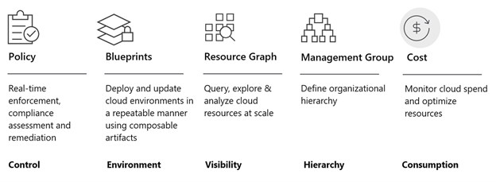

## Overview of Azure native features for cloud governance

The resources we have in the Azure portfolio to deliver this level of control are what you see in the image above. All of these are native features of the platform, in other words, nothing here is a different product that you need to purchase or deploy in your cloud environment. The moment you create your first subscription, these features are there for you to use right away and are completely free.

**Policy:** This is where you will define what can and cannot be deployed in the cloud. He will constantly check your signatures and resources to ensure that everything complies with corporate rules.

**Blueprints:** It helps you to configure your cloud environment so that it is managed properly and deployed in a repeatable manner. It allows a kind of implementation of governance as a code. Subscriptions are made available to development teams or departments as they are created. The goal here is that, when teams are presented with a subscription controlled by Blueprints, the amount of time they need to take from initial subscription settings, permits, policies, etc. to the implementation of the project in production decreases dramatically.

**Resource Graph:** This is a Big Data technology where we bring the configurations of all your resources from your cloud environment and offer you, through a structured query language, the ability to explore your environment very quickly, allowing visibility at scale over all your environment.
Management Group: If your organization has many subscriptions, you may need a way to efficiently manage access, policies and compliance for those subscriptions. This can be done through the Management Group.

**Cost Management:** Helps you understand your Azure invoice, monitor and control spending, and optimize resource usage. It allows you to analyze costs, create and manage budgets, export data, examine recommendations and act on them.

