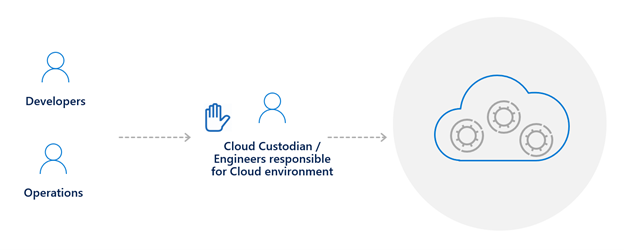
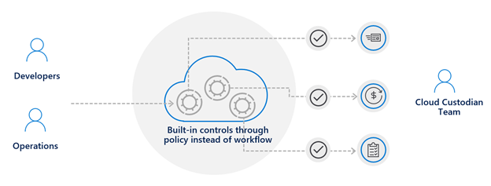

# Chapter 1 — Why Cloud Governance Matters

> **Last verified: 2026-04-06**

---

## Overview

Every organization migrating to the cloud faces a fundamental tension: **speed versus control**. Engineering teams want the agility to provision resources in minutes, while leadership needs assurance that spending, security, and compliance remain within acceptable boundaries. Cloud governance is the discipline that resolves this tension — not by slowing teams down, but by embedding guardrails directly into the platform.

### What Is Cloud Governance?

Cloud governance is the set of **policies, processes, and tools** that an organization uses to ensure its cloud environment operates in alignment with business objectives, regulatory requirements, and technical standards.

The Microsoft Cloud Adoption Framework (CAF) defines governance as:

> *"The process of establishing policies and continuously monitoring their proper enforcement. It is a set of controls and processes that ensure that Azure resources are deployed and managed in a compliant and cost-effective manner."*

Governance is not about restricting innovation — it is about creating the conditions under which innovation can happen safely and sustainably.

---

## The Speed-vs-Control Narrative

Companies adopt the cloud to be more agile and to reduce infrastructure costs. There is pressure to transform and innovate digitally, to shift focus away from managing servers and toward delighting customers with high-quality services. This drives a natural shift to DevOps in cloud environments, where engineers provision the resources they need to support solutions — often in minutes rather than weeks.

However, this agility comes at a price. Without governance, many organizations experience **Cloud Sprawl** — the uncontrolled proliferation of resources, subscriptions, and configurations that leads to runaway costs, security vulnerabilities, and compliance failures. This pattern is not new. In the early 2000s, server virtualization led to "VM sprawl." The industry response at the time was heavy-handed: insert an approval process, make teams fill out forms, wait two weeks for the infrastructure team to set up an environment.


<div align="center"><em>Traditional approach — sacrificing speed for control</em></div>
<br>

That approach does not work in the cloud era. It sacrifices the very agility that motivated the migration in the first place.

### The Cloud-Native Governance Model

In a cloud-native governance model, you achieve **speed and control simultaneously**. Instead of placing an approval bottleneck in front of every DevOps team, the cloud platform itself enforces controls on your behalf. Teams operate through a self-service model — they have full access to provision resources, but only within boundaries that the platform enforces automatically.

- Resources that violate policy are denied at deployment time.
- Costs remain predictable and aligned with budgets.
- Security controls are inherited, not optional.
- Compliance is continuous, not periodic.


<div align="center"><em>Cloud-native governance model — speed and control together</em></div>
<br>

---

## The CAF Five Disciplines of Cloud Governance

The Cloud Adoption Framework organizes governance into **five disciplines**. Each discipline addresses a specific area of risk that emerges when organizations operate in the cloud:

| Discipline | What It Addresses | Key Question |
|---|---|---|
| **Cost Management** | Budget overruns, uncontrolled spending, orphaned resources | *Are we spending what we planned to spend?* |
| **Security Baseline** | Data protection, threat detection, encryption, network security | *Are our workloads protected from threats?* |
| **Identity Baseline** | Authentication, authorization, identity lifecycle, privileged access | *Do only the right people have access to the right resources?* |
| **Resource Consistency** | Resource organization, naming, tagging, lifecycle management | *Can we find, manage, and operate our resources reliably?* |
| **Deployment Acceleration** | Infrastructure as Code, CI/CD pipelines, configuration drift, policy enforcement | *Can we deploy and update environments quickly, safely, and repeatably?* |

These five disciplines are not independent silos — they interconnect. For example, enforcing a **Security Baseline** requires a solid **Identity Baseline**, and achieving **Deployment Acceleration** depends on **Resource Consistency** through naming conventions and tagging strategies.

> **Key insight:** You do not need to mature all five disciplines at once. Start with the areas of greatest risk to your organization and expand over time.

> *Note: These five disciplines originate from the foundational CAF governance model and remain widely referenced. The current CAF Govern methodology organizes governance as a continuous process: build a governance team, assess risks, document policies, enforce policies, and monitor compliance.*

---

## Architecture

Cloud governance does not exist in isolation — it is woven into every layer of the Azure resource hierarchy. The diagram below shows how governance policies flow from the top of the hierarchy downward:

```
Microsoft Entra ID Tenant
  └── Root Management Group
        ├── Platform Management Group
        │     ├── Identity Subscription
        │     ├── Management Subscription
        │     └── Connectivity Subscription
        └── Landing Zones Management Group
              ├── Production Subscription
              │     └── Resource Groups → Resources (governed by policy)
              └── Non-Production Subscription
                    └── Resource Groups → Resources (governed by policy)
```

Governance controls — policies, RBAC role assignments, budgets — are applied at the management group or subscription level and **inherited** by all child scopes. This inheritance model is what makes cloud-native governance scalable.

---

## How It Works

1. **Define policies** that encode your organization's rules (e.g., "All storage accounts must use private endpoints").
2. **Assign policies** at management group or subscription scope so they apply broadly.
3. **Azure Resource Manager evaluates** every deployment request against assigned policies.
4. **Non-compliant requests are denied** at deployment time (or flagged for remediation, depending on the policy effect).
5. **Continuous compliance** is assessed — Azure Policy periodically scans existing resources and reports drift.

This "shift-left" approach means governance violations are caught **before** resources are deployed, not after an auditor discovers them months later.

---

## Best Practices

1. **Start with guardrails, not gates.** Use Azure Policy to prevent non-compliant deployments rather than manual approval workflows.
2. **Apply governance at the highest practical scope.** Assign policies at the management group level to ensure consistent enforcement across all subscriptions.
3. **Adopt the CAF five disciplines as your framework.** Even if you start small, structure your governance program around these disciplines so it scales.
4. **Treat governance as code.** Define policies, role assignments, and resource configurations in Bicep or Terraform. Store them in version control.
5. **Establish clear team responsibilities.** Define who owns governance decisions (e.g., a Cloud Center of Excellence) and who is responsible for implementation.

---

## Common Pitfalls

| Pitfall | Why It Hurts | What to Do Instead |
|---|---|---|
| No governance until after migration | Retroactive enforcement is painful and disruptive | Establish foundational governance before the first workload |
| Over-governance from day one | Teams rebel against excessive restrictions and find workarounds | Start with the minimum viable governance and iterate |
| Governance as a one-time project | Cloud environments evolve; static rules become stale | Treat governance as a continuous process with regular reviews |
| Siloed governance ownership | Security, finance, and platform teams set conflicting rules | Establish a cross-functional governance team or Cloud CoE |
| Ignoring the developer experience | If governance makes deployment harder, adoption suffers | Design guardrails that are invisible to teams doing the right thing |

---

## Code Samples

### Azure Policy — Deny Resources in Unapproved Regions

This policy ensures resources can only be deployed to approved Azure regions:

```json
{
  "properties": {
    "displayName": "Allowed locations",
    "policyType": "BuiltIn",
    "mode": "Indexed",
    "description": "Restricts resource deployment to approved regions.",
    "parameters": {
      "listOfAllowedLocations": {
        "type": "Array",
        "metadata": {
          "displayName": "Allowed locations",
          "description": "The list of locations that can be specified when deploying resources.",
          "strongType": "location"
        }
      }
    },
    "policyRule": {
      "if": {
        "not": {
          "field": "location",
          "in": "[parameters('listOfAllowedLocations')]"
        }
      },
      "then": {
        "effect": "deny"
      }
    }
  }
}
```

### Azure CLI — Assign the Built-In "Allowed Locations" Policy

```bash
az policy assignment create \
  --name "restrict-locations" \
  --display-name "Restrict to West Europe and North Europe" \
  --policy "e56962a6-4747-49cd-b67b-bf8b01975c4c" \
  --params '{"listOfAllowedLocations": {"value": ["westeurope", "northeurope"]}}' \
  --scope "/providers/Microsoft.Management/managementGroups/my-mg"
```

---

## Hands-On Exercise

**Scenario:** Your organization is about to begin its cloud journey. You have been asked to prepare a governance foundation.

1. **Identify your top three governance risks.** Consider: uncontrolled spending, unauthorized access, deployment to unapproved regions, or lack of resource visibility.
2. **Map each risk to a CAF discipline.** For example, "uncontrolled spending" maps to Cost Management.
3. **Draft one Azure Policy rule** (in JSON or pseudocode) that would mitigate your number-one risk.
4. **Determine the scope** where you would assign this policy (management group, subscription, or resource group) and justify your choice.

> **Bonus:** Review the [CAF Govern methodology](https://learn.microsoft.com/azure/cloud-adoption-framework/govern/) and identify which governance discipline your organization should prioritize first.

---

## Team Structure and Responsibilities

Aligned with governance, it is important to have a well-defined structure around responsibilities across different teams — especially if you are migrating from a traditional on-premises approach to a cloud-native model. The following resources will help you mature team structures and align responsibilities:

- [Mature team structures](https://learn.microsoft.com/azure/cloud-adoption-framework/organize/organization-structures)
- [Align responsibilities across teams](https://learn.microsoft.com/azure/cloud-adoption-framework/organize/raci-alignment)
- [Building technical skills](https://learn.microsoft.com/azure/cloud-adoption-framework/organize/suggested-skills)

---

## References

| Resource | Link |
|---|---|
| CAF Govern methodology | [learn.microsoft.com/azure/cloud-adoption-framework/govern/](https://learn.microsoft.com/azure/cloud-adoption-framework/govern/) |
| Mature team structures | [learn.microsoft.com/azure/cloud-adoption-framework/organize/organization-structures](https://learn.microsoft.com/azure/cloud-adoption-framework/organize/organization-structures) |
| Align responsibilities across teams | [learn.microsoft.com/azure/cloud-adoption-framework/organize/raci-alignment](https://learn.microsoft.com/azure/cloud-adoption-framework/organize/raci-alignment) |
| Azure Policy overview | [learn.microsoft.com/azure/governance/policy/overview](https://learn.microsoft.com/azure/governance/policy/overview) |

---

| | Next |
|:---|:---|
| | [Chapter 2 — Governance at a Glance](ch02-governance-at-a-glance.md) |
