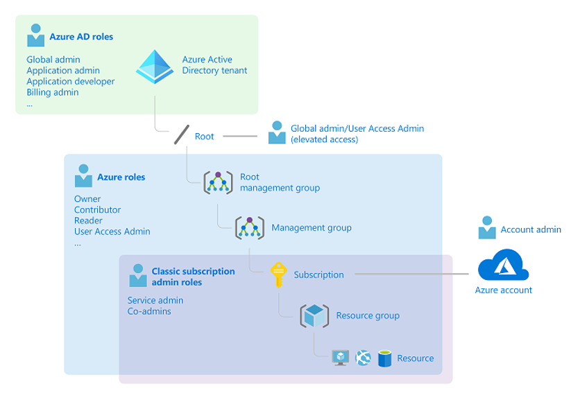
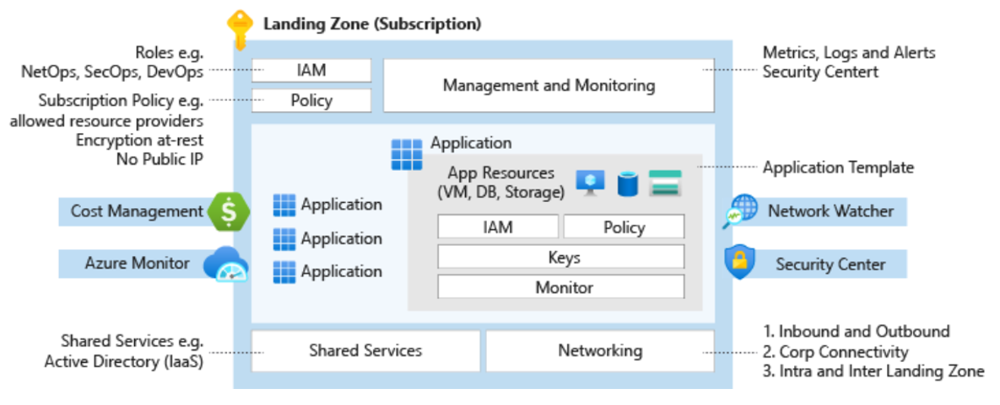

# Chapter 4 — The Azure Resource Hierarchy

> **Last verified: 2026-04-06**

---

## Overview

Every Azure deployment — from a single virtual machine to a multi-region enterprise platform — exists within a well-defined resource hierarchy. Understanding this hierarchy is not optional; it is the **structural foundation** upon which all governance controls are built.

The hierarchy has four levels:

```
Microsoft Entra ID Tenant
  └── Management Groups
        └── Subscriptions
              └── Resource Groups
                    └── Resources
```

**Governance controls — RBAC role assignments, Azure Policy, budgets — are applied at any level and inherited downward.** This inheritance model is what makes Azure governance scalable. A policy assigned at a management group automatically applies to every subscription, resource group, and resource beneath it.

This chapter covers each level in detail: what it is, how to design it, and the governance implications of your design decisions.

---

## Architecture

The Azure resource hierarchy is a tree structure with four levels. Governance controls applied at any level are inherited by all child levels:

```
┌──────────────────────────────────────────────────────────────┐
│  Microsoft Entra ID Tenant (Identity Boundary)               │
│  ┌────────────────────────────────────────────────────────┐  │
│  │  Root Management Group                                  │  │
│  │  ├── Platform MG                                        │  │
│  │  │     ├── Identity Sub ── RG ── Resources              │  │
│  │  │     ├── Management Sub ── RG ── Resources            │  │
│  │  │     └── Connectivity Sub ── RG ── Resources          │  │
│  │  ├── Landing Zones MG                                   │  │
│  │  │     ├── Corp MG                                      │  │
│  │  │     │     └── Prod Sub ── RG ── Resources            │  │
│  │  │     └── Online MG                                    │  │
│  │  │           └── Web Sub ── RG ── Resources             │  │
│  │  ├── Sandbox MG                                         │  │
│  │  │     └── Dev Sub ── RG ── Resources                   │  │
│  │  └── Decommissioned MG                                  │  │
│  └────────────────────────────────────────────────────────┘  │
└──────────────────────────────────────────────────────────────┘

Inheritance: Policy & RBAC flow DOWN the tree
            Tenant → MG → Subscription → Resource Group → Resource
```

Each level serves a distinct purpose. The sections below cover them in detail.

---

## 4.1 — Microsoft Entra ID Tenant

### What It Is

The **Microsoft Entra ID tenant** is the identity foundation of your Azure environment. It is the top-level container for all identities — users, groups, service principals, and managed identities — and the trust anchor for every Azure subscription.

When you create your first Azure subscription, a Microsoft Entra ID tenant is automatically created. The tenant receives a default domain in the format `yourname.onmicrosoft.com`, which you can customize to your organization's domain (e.g., `contoso.com`).

> **Key concept:** A tenant is not just "a representation of your company's domain." It is the **security boundary** for identity and access management. Everything inside the tenant shares a common identity plane; everything outside it is a separate trust domain.

### Tenant Components

| Component | Purpose |
|---|---|
| **Users** | Human identities that authenticate to Azure and other Microsoft services. |
| **Groups** | Collections of users (or other groups) used to simplify RBAC assignments. Prefer groups over individual user assignments. |
| **Service Principals** | Identities for applications and automation. Created when you register an app in Microsoft Entra ID. |
| **Managed Identities** | Azure-managed service principals that eliminate the need for credentials in code. Prefer these for Azure-to-Azure authentication. |
| **Enterprise Applications** | Third-party or Microsoft SaaS applications integrated via SAML, OIDC, or SCIM. |
| **Conditional Access Policies** | Rules that enforce access requirements (MFA, compliant device, approved location) based on signals. |

### How It Works

1. A user authenticates to **Microsoft Entra ID** and receives a token.
2. The token is presented to **Azure Resource Manager** with a request (e.g., "create a VM").
3. Azure Resource Manager checks the user's **RBAC role assignments** at the target scope.
4. If authorized, Azure Resource Manager evaluates **Azure Policy** to determine if the resource configuration is compliant.
5. The resource is created (or the request is denied).

### Microsoft Entra ID vs. Active Directory Domain Services

These are distinct services. Understanding the difference prevents costly architectural mistakes:

| Aspect | Microsoft Entra ID | Active Directory Domain Services (AD DS) |
|---|---|---|
| **Purpose** | Cloud identity and access management for Azure, Microsoft 365, and SaaS apps | On-premises directory services, Group Policy, Kerberos/NTLM authentication |
| **Protocols** | OAuth 2.0, OpenID Connect, SAML | Kerberos, NTLM, LDAP |
| **Structure** | Flat (no OUs or GPOs) | Hierarchical (domains, OUs, forests) |
| **Scope** | Cloud and hybrid | On-premises |

For hybrid scenarios, use **Microsoft Entra Connect** or **Microsoft Entra Cloud Sync** to synchronize on-premises AD DS identities to your Microsoft Entra ID tenant. This enables single sign-on across cloud and on-premises resources.

### Multi-Tenant Considerations

Most organizations should operate with a **single Microsoft Entra ID tenant**. Multiple tenants introduce complexity:

- Identities cannot be shared across tenants natively.
- Azure Policy and RBAC do not span tenants.
- Cross-tenant resource access requires explicit configuration (e.g., Azure Lighthouse, cross-tenant access settings).

Common reasons for multiple tenants include mergers/acquisitions, regulatory isolation requirements, or separate development/production identity boundaries. If you must operate multiple tenants, use **Microsoft Entra External ID cross-tenant access settings** to manage trust relationships.

### Best Practices for Tenant Governance

1. **Secure the tenant with Conditional Access.** Require MFA for all users, block legacy authentication, and enforce device compliance for sensitive workloads.
2. **Enable Privileged Identity Management (PIM).** Eliminate standing privileged access. All elevated roles should require just-in-time activation with approval and time limits.
3. **Conduct access reviews.** Use Microsoft Entra access reviews to periodically certify that users and groups still need their assigned roles.
4. **Use managed identities everywhere.** For Azure resources that need to authenticate to other Azure services, managed identities eliminate credential management entirely.
5. **Protect the Global Administrator role.** Limit to 2–3 break-glass accounts. Require MFA. Monitor sign-ins with Entra ID Protection.

### Pro Tips

- [Microsoft Entra ID Governance](https://learn.microsoft.com/entra/id-governance/identity-governance-overview)
- [Microsoft Entra access reviews](https://learn.microsoft.com/entra/id-governance/access-reviews-overview)
- [Compare Microsoft Entra ID and AD DS](https://learn.microsoft.com/entra/fundamentals/compare)

---

## 4.2 — Management Groups

### What They Are

**Management groups** are containers above subscriptions that let you organize subscriptions into a hierarchy and apply governance controls — RBAC, Azure Policy, budgets — at scale. Whatever you apply at a management group is **inherited** by every subscription (and every resource) beneath it.

Management groups solve a critical problem: without them, governance controls must be applied to each subscription individually. In an environment with dozens or hundreds of subscriptions, this approach does not scale and inevitably leads to inconsistency.

### How Management Groups Work

- Every Microsoft Entra ID tenant has a **root management group** (automatically created).
- You can create up to **6 levels of depth** below the root management group.
- Each management group can contain other management groups or subscriptions.
- A subscription can belong to only one management group at a time.
- You can move subscriptions between management groups without disruption.

### The CAF Recommended Management Group Hierarchy

The Cloud Adoption Framework recommends the following hierarchy as a starting point. You can adapt it to your organization's needs, but this structure has been validated across thousands of enterprise deployments:

```
Tenant Root Group
  └── Organization Root (e.g., mg-contoso)
        ├── Platform
        │     ├── Identity          ← Microsoft Entra ID infrastructure, domain controllers
        │     ├── Management        ← Log Analytics, Automation, monitoring
        │     └── Connectivity      ← Hub networking, DNS, firewalls, ExpressRoute
        │
        ├── Landing Zones
        │     ├── Corp              ← Internal/private workloads (connected to hub)
        │     └── Online            ← Internet-facing workloads
        │
        ├── Sandbox                 ← Developer experimentation (relaxed policies, cost limits)
        │
        └── Decommissioned          ← Subscriptions pending cleanup and deletion
```

### Governance Inheritance in Action

```
mg-contoso (Root)
  ├── Policy: "Require Owner tag on all resource groups"      ← applies to ALL
  ├── RBAC: "Reader" for Audit team                           ← applies to ALL
  │
  ├── mg-platform
  │     └── Policy: "Deny public IP creation"                 ← platform only
  │
  └── mg-landingzones
        ├── mg-corp
        │     └── Policy: "Require private endpoints for PaaS" ← corp only
        └── mg-online
              └── Policy: "Allow public endpoints with WAF"    ← online only
```

A key benefit: if a subscription owner tries to remove an inherited policy or role assignment, **they cannot**. Inherited controls are immutable at child scopes. This ensures that security controls applied by a central team (e.g., a SOC) remain in place regardless of what subscription owners do.

### Moving Subscriptions

If you initially made wrong decisions about your hierarchy — or if an application moves from development to production — you can create new management groups and move subscriptions without downtime. The subscription inherits the policies and RBAC of its new parent management group.

### Best Practices for Management Groups

1. **Keep the hierarchy shallow.** 2–3 levels below the root is sufficient for most organizations. Deep hierarchies are harder to reason about.
2. **Do not assign workloads to the root management group.** The root should contain only policies that apply universally (e.g., audit logging, allowed regions).
3. **Use Sandbox for experimentation.** Give developers a safe space with relaxed policies but strict cost limits.
4. **Use Decommissioned for cleanup.** Move subscriptions here before deletion to ensure resources are inventoried and data is retained per policy.
5. **Avoid assigning the Owner role at the management group level.** Owner at the root management group gives control over every subscription in the tenant.

### Pro Tip

- [Management groups overview](https://learn.microsoft.com/azure/governance/management-groups/overview)
- [CAF management group and subscription organization](https://learn.microsoft.com/azure/cloud-adoption-framework/ready/landing-zone/design-area/resource-org-management-groups)

---

## 4.3 — Subscriptions

### What They Are

A **subscription** is a logical container for Azure resources. It serves multiple purposes simultaneously:

| Purpose | Description |
|---|---|
| **Billing boundary** | All resources in a subscription are billed together. |
| **Scale boundary** | Each subscription has [service limits](https://learn.microsoft.com/azure/azure-resource-manager/management/azure-subscription-service-limits) (e.g., max VMs per region, max VNets). |
| **Policy boundary** | Azure Policy can be scoped to a subscription. |
| **Access boundary** | RBAC assignments at the subscription level grant access to all resources within it. |

### Subscription and Identity

A subscription has a **trust relationship** with a Microsoft Entra ID tenant for authentication and authorization:

- The same Microsoft Entra ID tenant can be trusted by **multiple subscriptions**.
- Each subscription trusts **exactly one** Microsoft Entra ID tenant.
- This means you can manage a unified user base across many subscriptions from a single tenant.

After creating or synchronizing users in Microsoft Entra ID, you grant those Entra ID users access to subscriptions and resources via RBAC role assignments.

### Roles and Assignments

There are two distinct categories of roles:

1. **Azure roles (RBAC):** Granted in the context of Azure resources. These roles use [Role-Based Access Control](https://learn.microsoft.com/azure/role-based-access-control/overview) and are assigned at management group, subscription, resource group, or resource scope. The three fundamental roles are Owner, Contributor, and Reader. Beyond these, there are over 500 built-in roles for specific services ([see the full list](https://learn.microsoft.com/azure/role-based-access-control/built-in-roles)). You can also create [custom roles](https://learn.microsoft.com/azure/role-based-access-control/custom-roles) for fine-grained control.

2. **Microsoft Entra ID roles:** Used exclusively for managing Microsoft Entra ID resources (users, groups, app registrations). These roles are separate from Azure RBAC roles.



### Designing Your Subscription Strategy

Having at least two subscriptions — one for the **production** environment and one for non-production — is a recommended starting point for environment segregation and access control. Depending on the size and compliance requirements of your environment, you may need additional subscriptions.

Use the [subscription design decision guide](https://learn.microsoft.com/azure/cloud-adoption-framework/decision-guides/subscriptions/) to determine the best approach for your organization. Key questions to ask:

- Do we need to separate workloads by compliance boundary?
- Do we need to isolate billing for different business units?
- Are we approaching subscription-level service limits?

### Subscription Vending

At scale, manually creating and configuring subscriptions is slow and error-prone. **Subscription vending** is the practice of automating subscription creation through a self-service process:

1. A team requests a new subscription (e.g., via a ServiceNow form or a Git pull request).
2. Automation (Bicep, Terraform, or Azure DevOps pipelines) creates the subscription, places it in the correct management group, assigns baseline policies, configures RBAC, sets up networking, and applies tags.
3. The team receives a production-ready subscription in minutes, not weeks.

See the [CAF subscription vending guidance](https://learn.microsoft.com/azure/cloud-adoption-framework/ready/landing-zone/design-area/subscription-vending) for implementation patterns.

### Azure Landing Zones

The [Azure Landing Zone architecture](https://learn.microsoft.com/azure/cloud-adoption-framework/ready/landing-zone/) provides a modular, scalable design for organizing subscriptions. It addresses:

- Enrollment and Microsoft Entra ID tenants
- Identity and access management
- Management group and subscription organization
- Network topology and connectivity
- Management and monitoring
- Business continuity and disaster recovery
- Security, governance, and compliance
- Platform automation and DevOps



The landing zone architecture supports different network topologies. For example, the **Hub and Spoke** topology maps to subscriptions as follows:

- A **shared services subscription** (Hub Virtual Network)
- A **production subscription** (Spoke 1 Virtual Network)
- A **non-production subscription** (Spoke 2 Virtual Network)

Hub and Spoke references:
- [Hub-spoke network topology](https://learn.microsoft.com/azure/architecture/reference-architectures/hybrid-networking/hub-spoke)
- [Define an Azure network topology](https://learn.microsoft.com/azure/cloud-adoption-framework/ready/azure-best-practices/define-an-azure-network-topology)

### Azure Landing Zone Accelerator Reference Implementations

The Azure Landing Zone Accelerator (formerly "Enterprise-Scale") offers reference implementations that can be deployed and scaled without refactoring:

| Implementation | Description | Link |
|---|---|---|
| **Foundation** (formerly Wingtip) | Minimal landing zone without hybrid connectivity | [GitHub](https://github.com/Azure/Enterprise-Scale/blob/main/docs/reference/wingtip/README.md) |
| **Hub and Spoke** (formerly AdventureWorks) | Landing zone with hub-spoke network topology | [GitHub](https://github.com/Azure/Enterprise-Scale/blob/main/docs/reference/adventureworks/README.md) |
| **Virtual WAN** (formerly Contoso) | Landing zone with Azure Virtual WAN network topology | [GitHub](https://github.com/Azure/Enterprise-Scale/blob/main/docs/reference/contoso/Readme.md) |

### Subscription Lifecycle

Subscription data is retained for a period after cancellation, and cancelled subscriptions remain visible in the Portal and APIs. Review the [cancellation process documentation](https://learn.microsoft.com/azure/cost-management-billing/manage/cancel-azure-subscription) before decommissioning.

### Best Practices for Subscriptions

1. **Use subscriptions as scale and isolation boundaries.** Separate production from non-production. Separate workloads with different compliance requirements.
2. **Automate subscription creation.** Use subscription vending to ensure every new subscription is configured consistently.
3. **Place every subscription in a management group.** Subscriptions outside the hierarchy miss inherited policies and RBAC.
4. **Monitor subscription-level service limits.** Use Azure Resource Graph to track usage against limits before hitting ceilings.
5. **Assign Contributor (not Owner) to workload teams.** Reserve Owner for the platform team. Use PIM for temporary Owner elevation.

### Pro Tip

- [Azure Landing Zone Accelerator](https://github.com/Azure/Enterprise-Scale)
- [Subscription vending](https://learn.microsoft.com/azure/cloud-adoption-framework/ready/landing-zone/design-area/subscription-vending)

---

## 4.4 — Resource Groups

### What They Are

A **resource group** is a logical container within a subscription that holds related Azure resources. Every Azure resource must belong to exactly one resource group.

Resource groups are powered by **Azure Resource Manager (ARM)**, which replaced the legacy Azure Service Manager (ASM) deployment model. ARM introduced structured resource organization, declarative deployments, and dependency management.

### Resource Group Design Patterns

How you organize resources into resource groups has governance implications. Here are three common patterns:

| Pattern | When to Use | Example |
|---|---|---|
| **By application** | Resources share the same application lifecycle | `rg-webapp-prod-westeu` contains the App Service, SQL Database, Key Vault, and Application Insights for a single app |
| **By lifecycle** | Resources are created and deleted together | `rg-networking-prod-westeu` contains all VNets and firewalls, which have a longer lifecycle than application resources |
| **By billing / cost center** | Resources must be tracked to a specific budget | `rg-marketing-analytics-prod` contains all resources charged to the marketing department |

> **Practical guidance:** The "by application" pattern is the most common and the safest default. It ensures that deleting a resource group removes all components of an application without affecting other workloads.

### How Resource Groups Work

- A resource group has a **location** (region), but this only stores the resource group's metadata. Resources inside the group can be in any region.
- **RBAC, Azure Policy, tags, and resource locks** can all be applied at the resource group level.
- Deleting a resource group **deletes all resources within it** — use resource locks to prevent accidental deletion of critical groups.
- Resources can be **moved** between resource groups (with some service-specific limitations).

### Best Practices for Resource Groups

1. **Use a consistent naming convention.** Example: `rg-{workload}-{environment}-{region}` → `rg-payments-prod-westeu`.
2. **Apply tags at the resource group level.** Tags on a resource group are **not** inherited by resources within it. Use Azure Policy to propagate tags if needed.
3. **Use resource locks on critical resource groups.** Apply a `CanNotDelete` lock to prevent accidental deletion of production resource groups.
4. **Design for lifecycle management.** Group resources that share the same create/update/delete lifecycle. This makes cleanup and redeployment straightforward.
5. **Keep resource groups focused.** A resource group with 200+ resources is hard to manage. Split by application or service boundary.

---

## Code Samples

### Bicep — Create a Resource Group with Tags

```bicep
targetScope = 'subscription'

param location string = 'westeurope'
param environment string = 'prod'
param workload string = 'payments'

resource rg 'Microsoft.Resources/resourceGroups@2024-03-01' = {
  name: 'rg-${workload}-${environment}-${location}'
  location: location
  tags: {
    Environment: environment
    Application: workload
    CostCenter: 'CC-4521'
    Owner: 'platform-team@contoso.com'
    CreatedBy: 'bicep'
    CreatedDate: '2026-04-06'
  }
}

output resourceGroupName string = rg.name
output resourceGroupId string = rg.id
```

### Azure CLI — Create a Resource Group

```bash
az group create \
  --name "rg-payments-prod-westeurope" \
  --location "westeurope" \
  --tags Environment=prod Application=payments CostCenter=CC-4521
```

### Azure CLI — Apply a Resource Lock

```bash
az lock create \
  --name "prevent-deletion" \
  --resource-group "rg-payments-prod-westeurope" \
  --lock-type CanNotDelete \
  --notes "Production resource group — do not delete"
```

### Bicep — Management Group Hierarchy (Full Example)

```bicep
targetScope = 'tenant'

resource rootMg 'Microsoft.Management/managementGroups@2023-04-01' = {
  name: 'mg-contoso'
  properties: {
    displayName: 'Contoso'
  }
}

resource platformMg 'Microsoft.Management/managementGroups@2023-04-01' = {
  name: 'mg-platform'
  properties: {
    displayName: 'Platform'
    details: { parent: { id: rootMg.id } }
  }
}

resource landingZonesMg 'Microsoft.Management/managementGroups@2023-04-01' = {
  name: 'mg-landingzones'
  properties: {
    displayName: 'Landing Zones'
    details: { parent: { id: rootMg.id } }
  }
}

resource corpMg 'Microsoft.Management/managementGroups@2023-04-01' = {
  name: 'mg-corp'
  properties: {
    displayName: 'Corp'
    details: { parent: { id: landingZonesMg.id } }
  }
}

resource onlineMg 'Microsoft.Management/managementGroups@2023-04-01' = {
  name: 'mg-online'
  properties: {
    displayName: 'Online'
    details: { parent: { id: landingZonesMg.id } }
  }
}

resource sandboxMg 'Microsoft.Management/managementGroups@2023-04-01' = {
  name: 'mg-sandbox'
  properties: {
    displayName: 'Sandbox'
    details: { parent: { id: rootMg.id } }
  }
}

resource decommissionedMg 'Microsoft.Management/managementGroups@2023-04-01' = {
  name: 'mg-decommissioned'
  properties: {
    displayName: 'Decommissioned'
    details: { parent: { id: rootMg.id } }
  }
}
```

---

## Hands-On Exercise

**Scenario:** You are designing the resource hierarchy for a mid-size company that has three business units (Engineering, Marketing, Finance), two environments (production, non-production), and plans to grow from 5 to 30 subscriptions over the next 18 months.

1. **Design a management group hierarchy.** Draw it out (text or diagram) using the CAF reference as a starting point. Decide where each business unit's subscriptions will live.
2. **Define a subscription naming convention.** For example: `sub-{businessunit}-{workload}-{environment}`.
3. **Define a resource group naming convention.** For example: `rg-{workload}-{environment}-{region}`.
4. **Identify which Azure Policies** you would assign at the root management group versus at the landing zone management group.
5. **Deploy the Bicep code sample above** to create your management group hierarchy in a test environment.

---

## Common Pitfalls

| Pitfall | Why It Hurts | What to Do Instead |
|---|---|---|
| No management group hierarchy | Policies must be assigned per-subscription; new subscriptions are ungoverned | Implement the CAF hierarchy before adding more subscriptions |
| Treating the tenant as just an identity provider | Missing Conditional Access, PIM, and access reviews creates security gaps | Govern the tenant as a critical security boundary |
| Too many subscriptions without a naming convention | Impossible to identify purpose, owner, or environment | Define naming before creating subscriptions |
| All resources in one resource group | Deleting the group or applying RBAC becomes all-or-nothing | Group by application lifecycle |
| Granting Owner at subscription scope | Over-privileged users can bypass governance controls | Use Contributor + PIM for elevation |

---

## References

| Resource | Link |
|---|---|
| Microsoft Entra ID overview | [learn.microsoft.com/entra/fundamentals/whatis](https://learn.microsoft.com/entra/fundamentals/whatis) |
| Microsoft Entra ID Governance | [learn.microsoft.com/entra/id-governance/identity-governance-overview](https://learn.microsoft.com/entra/id-governance/identity-governance-overview) |
| Compare Microsoft Entra ID and AD DS | [learn.microsoft.com/entra/fundamentals/compare](https://learn.microsoft.com/entra/fundamentals/compare) |
| Management groups overview | [learn.microsoft.com/azure/governance/management-groups/overview](https://learn.microsoft.com/azure/governance/management-groups/overview) |
| CAF management group design | [learn.microsoft.com/azure/cloud-adoption-framework/ready/landing-zone/design-area/resource-org-management-groups](https://learn.microsoft.com/azure/cloud-adoption-framework/ready/landing-zone/design-area/resource-org-management-groups) |
| Azure subscription service limits | [learn.microsoft.com/azure/azure-resource-manager/management/azure-subscription-service-limits](https://learn.microsoft.com/azure/azure-resource-manager/management/azure-subscription-service-limits) |
| Subscription decision guide | [learn.microsoft.com/azure/cloud-adoption-framework/decision-guides/subscriptions/](https://learn.microsoft.com/azure/cloud-adoption-framework/decision-guides/subscriptions/) |
| Azure Landing Zone overview | [learn.microsoft.com/azure/cloud-adoption-framework/ready/landing-zone/](https://learn.microsoft.com/azure/cloud-adoption-framework/ready/landing-zone/) |
| Subscription vending | [learn.microsoft.com/azure/cloud-adoption-framework/ready/landing-zone/design-area/subscription-vending](https://learn.microsoft.com/azure/cloud-adoption-framework/ready/landing-zone/design-area/subscription-vending) |
| Azure RBAC built-in roles | [learn.microsoft.com/azure/role-based-access-control/built-in-roles](https://learn.microsoft.com/azure/role-based-access-control/built-in-roles) |
| Azure Resource Manager overview | [learn.microsoft.com/azure/azure-resource-manager/management/overview](https://learn.microsoft.com/azure/azure-resource-manager/management/overview) |
| Resource groups principles | [learn.microsoft.com/training/modules/control-and-organize-with-azure-resource-manager/2-principles-of-resource-groups](https://learn.microsoft.com/training/modules/control-and-organize-with-azure-resource-manager/2-principles-of-resource-groups) |

---

| Previous | Next |
|:---|:---|
| [Chapter 3 — Governance Maturity Model](ch03-governance-maturity-model.md) | [Chapter 5 — Naming and Tagging Strategy](ch05-naming-tagging-strategy.md) |
