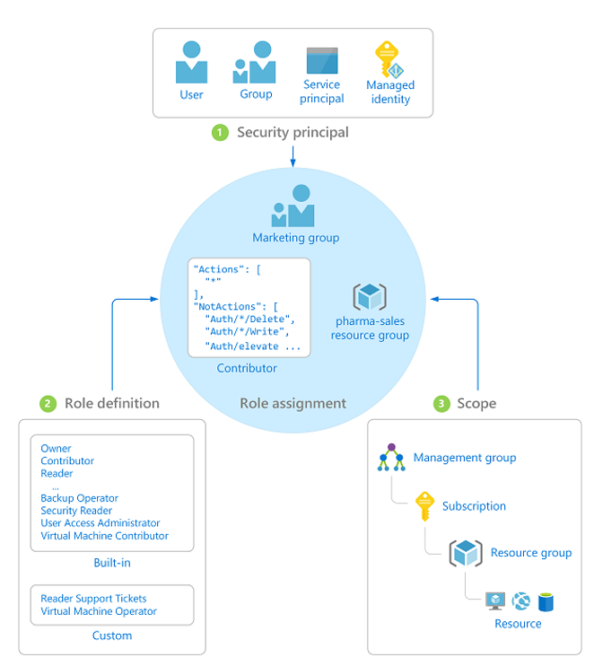
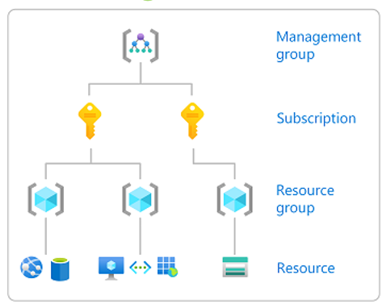

# Chapter 6 — Role-Based Access Control (RBAC)

> Last verified: 2026-04-06

---

## Overview

Role-Based Access Control (RBAC) is the authorization system built into Azure Resource Manager. It lets you grant precisely the permissions people and workloads need — nothing more, nothing less. Instead of handing out blanket access to a subscription, you define *who* can do *what* at a specific *scope*.

Azure now ships with **over 300 built-in roles**, covering everything from broad "Contributor" access down to narrow, service-specific roles like *Cosmos DB Operator* or *Key Vault Secrets User*. When none of those fit, you can craft a **custom role** tailored to your organization.



---

## How It Works

Every RBAC assignment is the intersection of three things:

| Concept | Description |
|---------|-------------|
| **Security Principal** | The identity requesting access — a user, group, service principal, or managed identity (see [Chapter 8](ch08-managed-identities.md)). |
| **Role Definition** | A collection of allowed (and denied) actions. Can be built-in or custom. |
| **Scope** | Where the permissions apply — management group, subscription, resource group, or individual resource. |

### Scope hierarchy

Permissions are **inherited** top-down. A role assigned at the subscription scope applies to every resource group and resource beneath it.

```
Management Group
  └─ Subscription
       └─ Resource Group
            └─ Resource
```



### Role types

| Type | Description |
|------|-------------|
| **Built-in roles** | Over 300 predefined roles maintained by Microsoft (e.g., Owner, Contributor, Reader, plus service-specific roles). |
| **Custom roles** | Roles you create when built-in roles don't match your requirements. Custom roles can be scoped to management groups, subscriptions, or resource groups. |

---

## Attribute-Based Access Control (ABAC) — Conditions in RBAC

Standard RBAC answers *"Can this principal perform this action at this scope?"*. ABAC adds a fourth dimension: **conditions** based on resource attributes.

For example, you can grant a principal the *Storage Blob Data Reader* role but add a condition that restricts access to blobs tagged with `project=alpha`. This is expressed through **role assignment conditions** written in a declarative condition language.

### When to use ABAC

- **Storage accounts** — restrict read/write to blobs matching specific tags, container names, or blob index tags.
- **Fine-grained data-plane control** — when you need permissions more granular than a role definition alone can provide, without creating dozens of custom roles.

### Example condition (conceptual)

```
(
  @Resource[Microsoft.Storage/storageAccounts/blobServices/containers/blobs:tags<$key$>]
  StringEquals 'project' 'alpha'
)
```

> **Note:** ABAC conditions are currently supported on a subset of Azure services, with Azure Storage being the most mature. Check the [ABAC conditions documentation](https://learn.microsoft.com/azure/role-based-access-control/conditions-overview) for the latest service support.

---

## Custom Role Creation

When the 300+ built-in roles aren't granular enough, create a custom role. Custom roles can include any combination of `Actions`, `NotActions`, `DataActions`, and `NotDataActions`.

### Bicep example — custom role definition

The following Bicep template creates a custom role called *VM Restart Operator* scoped to a subscription, allowing only the restart action on virtual machines:

```bicep
targetScope = 'subscription'

@description('The subscription ID where the custom role will be assignable.')
param assignableScope string = subscription().id

resource customRole 'Microsoft.Authorization/roleDefinitions@2022-04-01' = {
  name: guid(subscription().id, 'vm-restart-operator')
  properties: {
    roleName: 'VM Restart Operator'
    description: 'Can view virtual machines and restart them.'
    type: 'CustomRole'
    assignableScopes: [
      assignableScope
    ]
    permissions: [
      {
        actions: [
          'Microsoft.Compute/virtualMachines/read'
          'Microsoft.Compute/virtualMachines/restart/action'
        ]
        notActions: []
        dataActions: []
        notDataActions: []
      }
    ]
  }
}
```

> **Limits:** Each Microsoft Entra ID tenant can have up to 5,000 custom roles. Custom roles can be scoped to management groups — use this to share a role across multiple subscriptions.

---

## Best Practices

1. **Apply least privilege** — assign only the permissions required for the task. Avoid Owner or Contributor when a narrower role exists.

2. **Use Microsoft Entra ID groups, not individual assignments** — assign roles to groups and manage membership. This scales better and is far easier to audit.

3. **Avoid Owner at subscription scope** — Owner includes full access *plus* the ability to assign roles to others. Reserve it for break-glass accounts only.

4. **Use Privileged Identity Management (PIM) for elevated access** — instead of standing privileged assignments, use PIM to enable just-in-time activation with approval workflows and time-bound access. See [Chapter 7 — Microsoft Entra ID Governance](ch07-entra-id-governance.md) for a deep dive.

5. **Review assignments regularly** — stale assignments are a governance risk. Combine RBAC with Access Reviews (also in [Chapter 7](ch07-entra-id-governance.md)) to automate periodic reviews.

6. **Scope assignments as narrowly as possible** — prefer resource-group-scoped or resource-scoped assignments over subscription-level ones.

7. **Leverage deny assignments when needed** — Azure Blueprints (deprecated, EOL July 2026) and Deployment Stacks can create deny assignments that block specific actions, even for Owners.

8. **Audit with Azure Activity Log and Resource Graph** — use `Microsoft.Authorization/roleAssignments` operations in the Activity Log, and query role assignments at scale with Azure Resource Graph.

---

## Common Pitfalls

| Pitfall | Why It Hurts | Fix |
|---------|-------------|-----|
| Assigning Owner at subscription scope "just to unblock the team" | Anyone with Owner can grant themselves — or others — any permission. | Use Contributor + a narrow custom role for the specific gap. |
| Assigning roles to individual users | Hard to audit, inconsistent when people change teams. | Always assign to Microsoft Entra ID groups. |
| Ignoring inherited assignments | A broad role at the management group trickles down everywhere. | Periodically review effective access with `az role assignment list`. |
| Creating too many custom roles | Each tenant can have up to 5,000, but managing hundreds is painful. | Evaluate built-in roles first; use ABAC conditions before creating new roles. |
| Forgetting data-plane roles | Control-plane Contributor does **not** give data-plane access (e.g., reading blobs). | Assign the appropriate data-plane role (e.g., *Storage Blob Data Reader*). |

---

## Code Samples

### Assign a built-in role via Azure CLI

The following command assigns the **Reader** role to a Microsoft Entra ID group on a resource group:

```bash
# Assign the "Reader" role to a group at a resource group scope
az role assignment create \
  --assignee-object-id "aaaaaaaa-bbbb-cccc-dddd-eeeeeeeeeeee" \
  --assignee-principal-type Group \
  --role "Reader" \
  --scope "/subscriptions/<subscription-id>/resourceGroups/<rg-name>"
```

> **Tip:** Always specify `--assignee-principal-type` to avoid ambiguous look-ups and speed up assignment creation.

### List all role assignments on a subscription

```bash
az role assignment list \
  --subscription "<subscription-id>" \
  --output table
```

### Query role assignments at scale with Azure Resource Graph

```kusto
authorizationresources
| where type == "microsoft.authorization/roleassignments"
| extend roleDefinitionId = tostring(properties.roleDefinitionId)
| extend principalId = tostring(properties.principalId)
| extend scope = tostring(properties.scope)
| project roleDefinitionId, principalId, scope
```

---

## References

- [Azure RBAC overview](https://learn.microsoft.com/azure/role-based-access-control/overview)
- [Azure built-in roles](https://learn.microsoft.com/azure/role-based-access-control/built-in-roles)
- [Custom roles for Azure resources](https://learn.microsoft.com/azure/role-based-access-control/custom-roles)
- [ABAC conditions in Azure RBAC](https://learn.microsoft.com/azure/role-based-access-control/conditions-overview)
- [Manage access with Azure RBAC (Microsoft Learn training)](https://learn.microsoft.com/training/modules/manage-subscription-access-azure-rbac/)
- [Privileged Identity Management — Chapter 7](ch07-entra-id-governance.md)

---

Previous | Next
:--- | :---
[Part 1 — Foundations](../part-1-foundations/) | [Chapter 7 — Microsoft Entra ID Governance](ch07-entra-id-governance.md)
