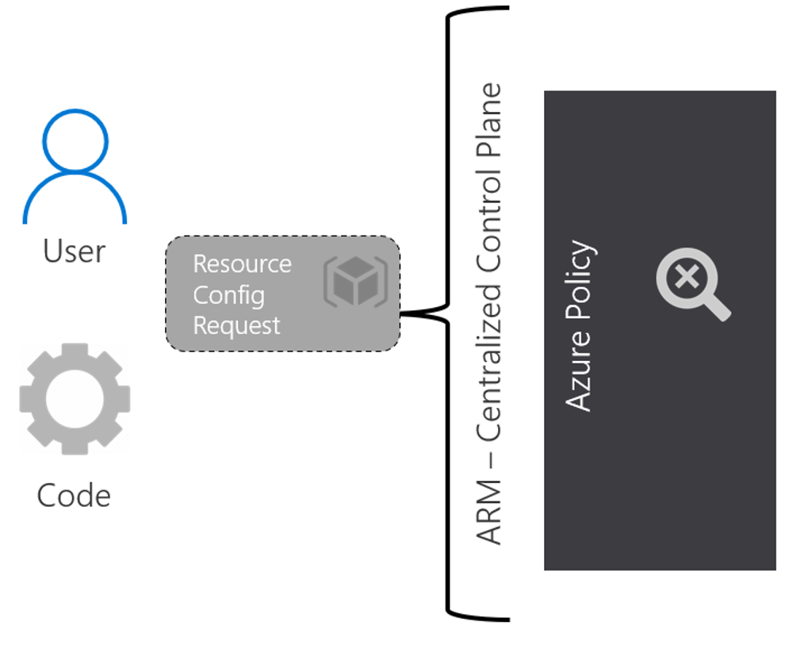
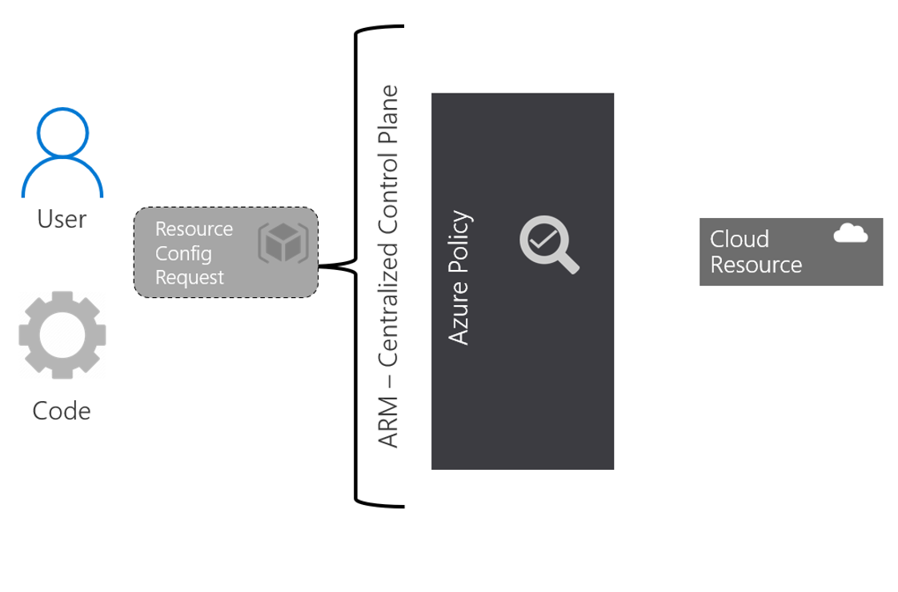
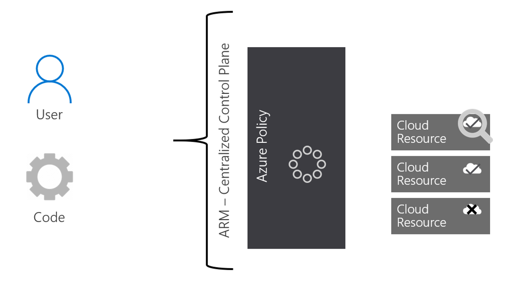
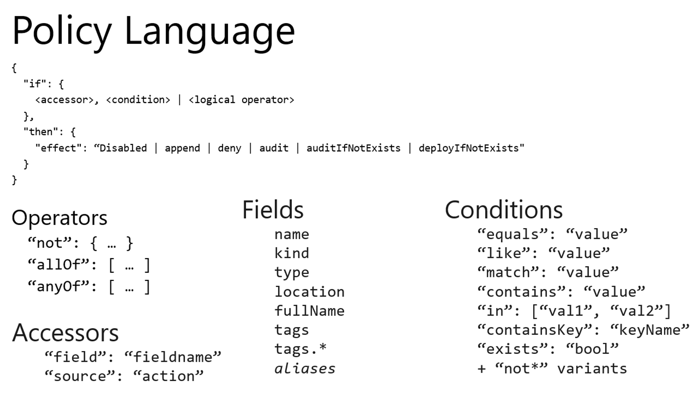

### Azure Policy

Policy is the backbone of Azure implementation and compliance. Compliance is an evolving scenario that you will always need to assess and adjust according to the needs of the moment. You also need to carefully plan your policies so as not to interrupt other units that require a more flexible policy than the one you have defined.

Through policies, you can control the types of resources that can be provisioned. Or, you can restrict the locations where resources can be provisioned. Unlike RBAC, the policy is a standard system of explicit permission and denial.

Azure Policy is a service that you use to create, assign and manage policy definitions. Policy definitions impose different rules and actions on your resources, so that those resources remain in compliance with your corporate standards and service level agreements.

The policy focuses on the properties of resources during deployment and for existing resources. It performs an assessment of your resources, checking those that do not conform to the policy definitions you have. A very interesting new feature is the VM guest policy which extends the policy's capacity to the resources running within your VMs.

Below a sample on how Azure Policy can help with governance.

Your DevOps request to deploy resources in Azure for a given project using a pre-built JSON model to make things easier and faster. Let's say they want to deploy 5 G series VMs in Europe (high ratio of memory to CPU and are ideal for database servers) and 5 Ls in the USA (high disk transfer rate, ideal for big data and SQL).

Azure Policy takes action and scans

**Order of evaluation**

Requests to create or update a resource through Azure Resource Manager are evaluated by Policy first. Policy creates a list of all assignments that apply to the resource and then evaluates the resource against each definition. Policy processes several of the effects before handing the request to the appropriate Resource Provider. Doing so prevents unnecessary processing by a Resource Provider when a resource doesn't meet the designed governance controls of Policy.

**Disabled** is checked first to determine whether the policy rule should be evaluated.

**Append** is then evaluated. Since append can change the request, a change made by append can prevent an audit or denial effect from triggering. Append is used to add additional fields to the requested resource during creation or update. A common example is to add tags to resources such as costCenter or to specify allowed IPs for a storage resource.

**Deny** is then evaluated. When assessing denial before the audit, double registration of an unwanted appeal is avoided. Deny is used to avoid a resource request that does not match the standards set through a policy definition and the request fails.

**Audit** is then evaluated before the request goes to the Resource Provider. The audit is used to create a warning event in the activity log when evaluating an unsupported resource, but not for the request.

After the resource provider returns a success code, AuditIfNotExists and DeployIfNotExists evaluate to determine whether additional compliance logging or action is required.

**AuditIfNotExists**

AuditIfNotExists enables auditing on resources that match the **if** condition, but does not have the components specified in the **details** of the **then** condition.

**DeployIfNotExists**

Similar to AuditIfNotExists, DeployIfNotExists performs a model deployment when the condition is met.

Reference: [https://docs.microsoft.com/en-us/azure/governance/policy/overview](https://docs.microsoft.com/en-us/azure/governance/policy/overview) 

