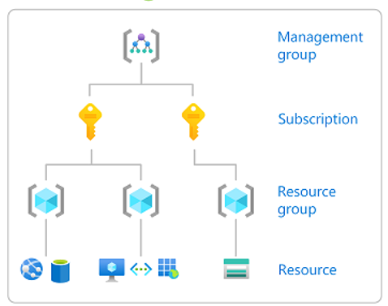

## RBAC

Role Based Access Control (RBAC) allows you to separate tasks within your team and grant only the amount of access that users need to perform their tasks. Instead of giving everyone unrestricted permissions on your subscription or Azure features, you can only allow certain actions within a given scope.

**Security Principal**

A security principal is an object that represents a user, group, service principal, or managed identity that is requesting access to Azure resources.

- *Service Principal*: a security identity used by applications or services to access specific Azure features. You can think of it as a user identity (username and password or certificate) for an application.

- *Managed Identity*: an identity in Azure Active Directory that is automatically managed by Azure. Typically, you use managed identities when developing cloud applications to manage credentials for authenticating to Azure services.

**Role Definition**

A role definition is a collection of permissions. Sometimes, it is just called role. A role definition lists operations that can be performed, such as reading, writing, and deleting. The roles can be high-level, as an owner, or specific, as a virtual machine reader. You can create custom roles if none of the existing integrated roles does not meet your organization's specific needs.

**Scope**

The scope is the limit to which access applies. When assigning a role, you can further limit the actions allowed by defining a scope. This is useful if you want to make someone a Website Contributor for example, but only for a group of resources.

Scopes can be Management Groups**, Subscriptions, Resource Group or a Resource itself. It is important to note that RBAC permissions have a top-down hierarchy, which means that when defining a role definition in a higher scope, it will be replicated to objects in the lower scope. So, if you grant Contributor permission to someone at the subscription level, that permission will be inherited in all resource groups under this subscription, as well as resources.

Reference: [https://docs.microsoft.com/pt-br/azure/role-based-access-control/overview](https://docs.microsoft.com/pt-br/azure/role-based-access-control/overview)

** Management Group is a feature of Azure to facilitate the management of access and policies in environments with multiple signatures. We will cover it in more detail in the advanced governance topics.

