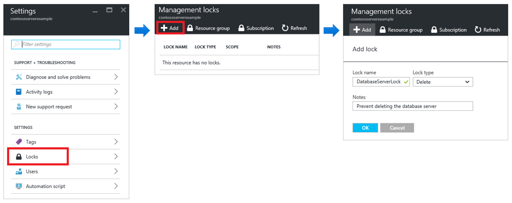

## Resource Locks

Resource Locks are a feature that allows you to avoid accidentally deleting or modifying critical resources. The lock overrides any permissions the user might have.

When you apply a lock on a parent scope, all resources within that scope inherit the same lock. Even the features you add later inherit the parent's lock. The most restrictive block on inheritance takes precedence.

Unlike role-based access control, you use management locks to apply a restriction to all users and roles.

Resource Manager locks apply only to operations that take place in the management plan, which consists of operations sent to [https://management.azure.com](https://management.azure.com). Locks do not restrict how resources perform their own functions. Resource changes are restricted, but resource operations are not restricted. For example, a ReadOnly lock on an SQL database prevents you from deleting or modifying the database, but it does not prevent you from creating, updating, or deleting data in the database. Data transactions are allowed because these transactions are not sent to [https://management.azure.com](https://management.azure.com) 

Applying ReadOnly can lead to unexpected results because some operations that look like read operations actually require additional actions. For example, placing a ReadOnly lock on a storage account prevents all users from listing keys. The operation of list keys is handled through a POST request because the returned keys are available for write operations. For another example, placing a ReadOnly lock on an application service resource prevents Visual Studio Server Explorer from displaying files for the resource because that interaction requires write access.

Reference: [https://docs.microsoft.com/en-us/azure/azure-resource-manager/management/lock-resources](https://docs.microsoft.com/en-us/azure/azure-resource-manager/management/lock-resources) 
